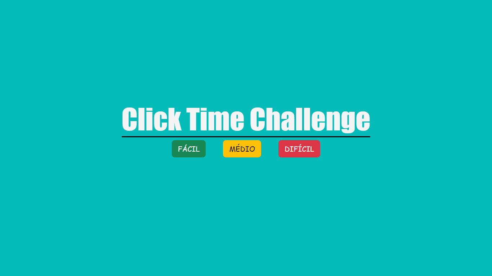

# Projeto Click Time Challenge

## Projeto desenvolvido para recriar um jogo onde podemos treinar nosso tempo de reação com círculos aparecendo no meio da tela.

---
## Ideias iniciais:
- Desenvolver uma lógica para um jogo, com muitas pesquisas.
- Utilizar-se de um uma interface bem simples para já começar jogando.
- Utilizar sons para marcar erros e acertos.
- Apresentar feedbacks ao fim do tempo.
---
## Tecnologias Utilizadas:
- HTML
- CSS
- JAVASCRIPT
- BOOTSTRAP