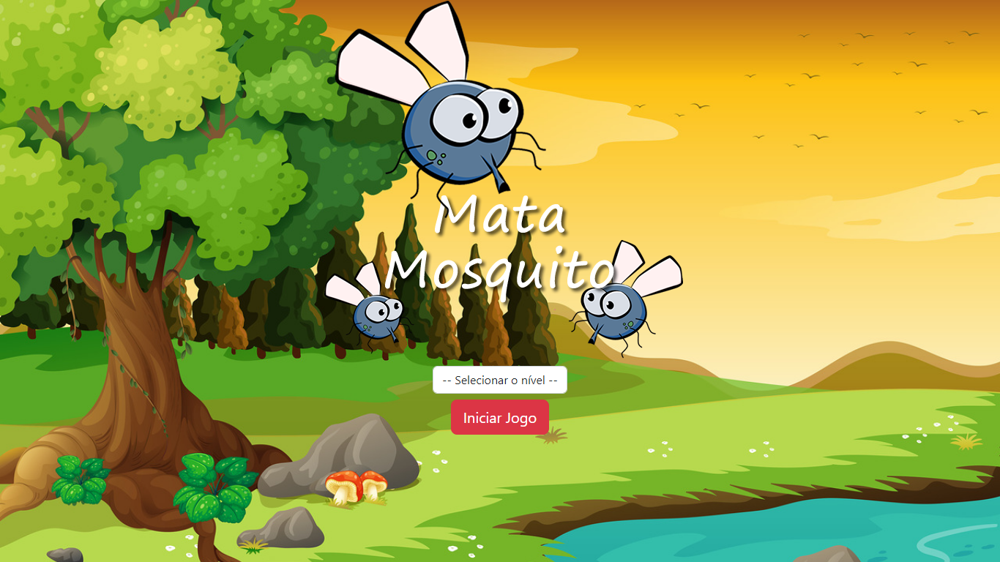

# Projeto Mata mosquito

## Projeto feito com instrução do professor Jorge Saint Ana pela plataforma Udemy.
---
## Ideias iniciais:
- Compreender a base do Javascript. 
- Implementar melhorias ao projeto conforme eu fosse aprendendo mais sobre a linguagem.
---
## Tecnologias Utilizadas:
- HTML
- CSS
- BOOTSTRAP
- JAVASCRIPT